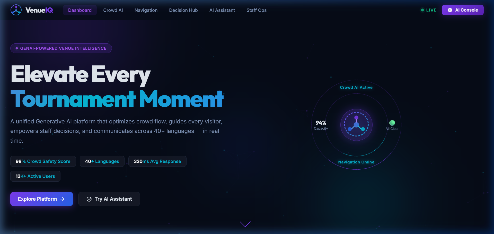

# VenueIQ — GenAI Tournament Operations Platform

<div align="center">



**A GenAI-enabled architecture that directly optimizes venue operations and elevates the tournament experience for fans, organizers, volunteers, and on-ground staff.**

[](https://developer.mozilla.org/en-US/docs/Web/HTML)
[](https://developer.mozilla.org/en-US/docs/Web/CSS)
[](https://developer.mozilla.org/en-US/docs/Web/JavaScript)

</div>

---

## 🎯 Overview

VenueIQ is a unified **Generative AI platform** designed for tournament venues that:

- 🌡️ **Dynamically manages crowd flow** using AI-driven density analysis and proactive routing
- 🗺️ **Guides every visitor** with smart indoor navigation and AR-ready wayfinding
- ⚡ **Empowers operational decisions** through real-time AI incident analysis
- 🌍 **Communicates across 40+ languages** via an intelligent multi-persona conversational assistant
- 👷 **Optimizes staff deployment** with AI-powered task allocation and skill matching

---

## 📸 Screenshots

| Module | Preview |
|--------|---------|
| Operations Dashboard |  |
| Dynamic Crowd Management |  |
| Smart Indoor Navigation |  |
| Real-Time Decision Hub |  |
| Multi-Language AI Assistant |  |
| Staff & Volunteer Ops |  |

---

## 🚀 Quick Start

```bash
# Clone the repository
git clone https://github.com/mahamadhu036/VenueIQ-GenAI-Tournament-Operations-Platform.git
cd VenueIQ-GenAI-Tournament-Operations-Platform

# Serve locally (Python 3)
python -m http.server 8765

# Open in browser
# → http://localhost:8765
```

No build tools, no npm, no dependencies — just open `index.html` in any modern browser.

---

## 🏗️ Architecture

```
VenueIQ/
├── index.html              ← SPA structure with 6 modules + AR modal
├── styles.css              ← Complete dark glassmorphic design system
├── app.js                  ← GenAI simulation engine & full app logic
└── docs/
    ├── WALKTHROUGH.md      ← Detailed feature walkthrough
    ├── screenshots/        ← UI screenshots of all modules
    └── recordings/         ← Platform demo recording (.webp)
```

---

## 🤖 GenAI Modules

### 1. 🌡️ Dynamic Crowd Management
- **Real-time Canvas heatmap** showing crowd density across all venue zones
- **AI crowd flow simulation** — click "Run AI Simulation" to watch zones update live
- **Predictive 2-hour forecast** chart with critical threshold alerts
- **Proactive AI routing** recommendations to reduce overcrowding
- **Entry/exit flow analytics**, dwell time analysis, gate utilization
- Zone-level occupancy cards with capacity percentages

### 2. 🗺️ Smart Indoor Navigation
- **Canvas-rendered venue floor plan** with animated route paths
- **6 destination types**: Seat, Food Court, Restroom, Medical, Exit, VIP Parking
- **4 navigation modes**: Walking, Accessible ♿, Fastest, VIP Route
- **Step-by-step directions** with distance estimates
- **Points of Interest grid** with proximity data
- **AR Navigation modal** with animated compass and progress tracking

### 3. ⚡ Real-Time Decision Support Hub
- **Incident Command Board** with severity filtering (Critical / Medium / Low)
- **AI Analyze button** on each incident — generates LLM-style tactical response
- **AI Command Recommendations** panel with actionable directives
- **Resource Dispatch grid** — toggle security, medics, volunteers, transport
- **Event Timeline** with real-time current event highlighting
- **Command AI Chat** — natural language query interface for command staff
- Simulate Emergency button for drill/demo purposes

### 4. 🤖 Multi-Language AI Assistant
- **4 personas**: Fan Mode 🎟️ / Staff Mode 👷 / Volunteer Mode 🤝 / Organizer Mode 📋
- **Context-aware responses** based on selected persona and query intent
- **Quick-prompt chips** dynamically change per persona
- **40+ language display** with usage analytics bar chart
- **Live Translation Engine** — type any message, select source/target language
- **Voice input simulation** with recording animation
- **Language selector** (10 UI languages) with bilingual response support
- Chat export functionality

### 5. 👷 Staff & Volunteer Operations
- **Canvas-based staff deployment map** with role-coded colored dots and coverage zones
- **AI-generated task queue** with priority colors and zone/assignee assignments
- **Staff summary cards** — Security, Medics, Volunteers, Operations counts
- **Response time analytics** bar chart by role
- **Zone coverage heatbar** chart
- **Volunteer skill match rate** visualization
- One-click "AI Optimize Deployment" button

### 6. 📊 Operations Dashboard
- **4 live KPI cards** — Visitors, Active Alerts, Navigation Queries, AI Interactions
- **Real-time crowd density heatmap** (canvas-rendered stadium view)
- **Zone occupancy horizontal bar chart**
- **Live Alert Feed** with type-coded color alerts (critical/warning/info/success)
- **AI Insights & Predictions** panel
- **Venue Conditions widget** — weather + AI hydration recommendation

---

## 🎨 Design System

| Attribute | Value |
|-----------|-------|
| Theme | Dark Glassmorphic |
| Primary | `#7c3aed` (Purple) |
| Accent | `#06b6d4` (Cyan) |
| Background | `#060b17` (Deep Navy) |
| Typography | Inter + Outfit (Google Fonts) |
| Animations | CSS keyframes + Canvas requestAnimationFrame |
| Charts | Vanilla Canvas API |

---

## 📁 Docs

- 📄 [WALKTHROUGH.md](docs/WALKTHROUGH.md) — Full feature walkthrough
- 🎬 [Platform Demo Recording](docs/recordings/platform_walkthrough.webp) — Animated platform tour
- 🖼️ [Screenshots](docs/screenshots/) — All 8 module screenshots

---

## 📋 Feature Checklist

- [x] Dynamic crowd management with live simulation
- [x] Smart indoor navigation with AR preview
- [x] Real-time decision support with AI incident analysis
- [x] Multi-language assistant (40+ languages)
- [x] Staff & volunteer AI deployment optimization
- [x] Animated neural network hero background
- [x] Canvas-rendered heatmaps and charts
- [x] Dark glassmorphic premium design
- [x] Responsive layout (900px–1600px+)
- [x] Zero external JS dependencies

---

## 🏆 Use Cases

| Role | Primary Modules |
|------|----------------|
| **Tournament Fan** | AI Assistant (Fan Mode), Indoor Navigation, Crowd Status |
| **Security Staff** | Decision Hub, Crowd Management, Staff Ops |
| **Medical Team** | Decision Hub (Medical Dispatch), Staff Ops |
| **Volunteer** | AI Assistant (Volunteer Mode), Staff Ops, Navigation |
| **Event Organizer** | Dashboard, Decision Hub, AI Assistant (Organizer Mode) |
| **Operations Manager** | All 6 modules + Command AI Chat |

---

## 📜 License

MIT License — Free to use for educational and demonstration purposes.

---

<div align="center">
  <strong>Built for the era of AI-powered live events 🏟️✨</strong>
</div>
